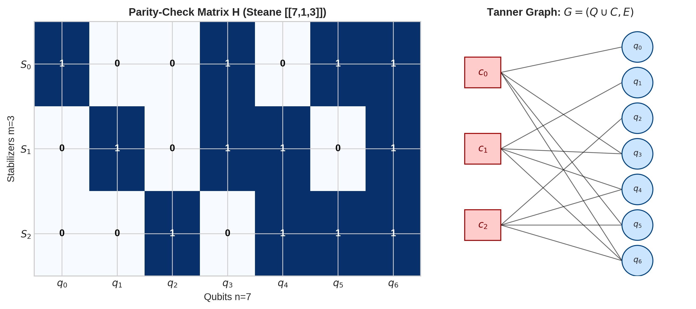
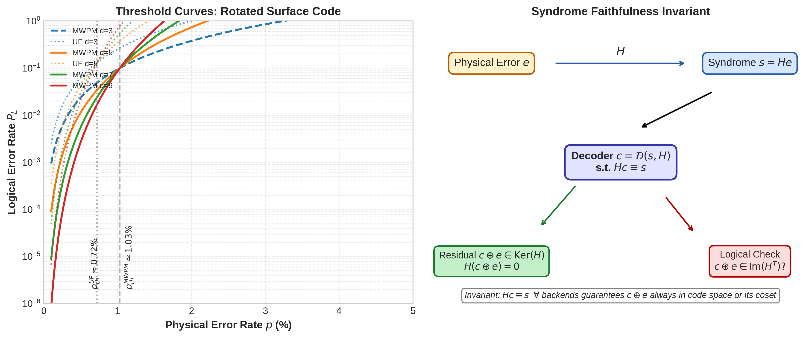
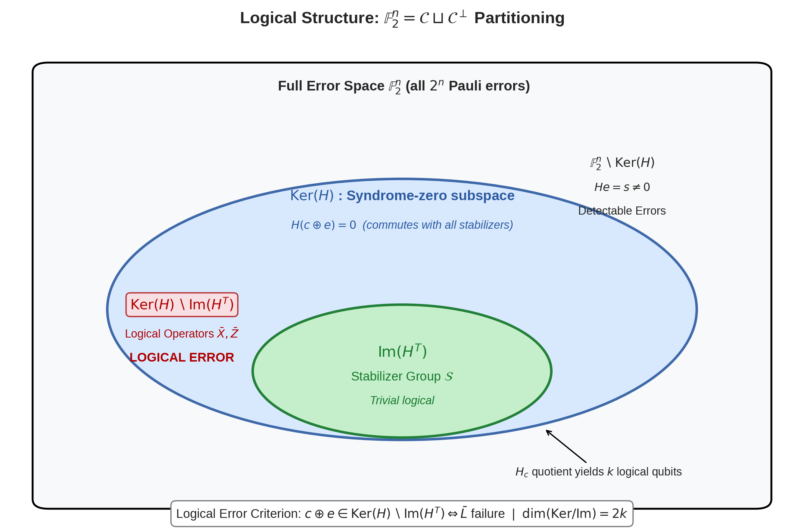

# Mathematical Foundations of Fault-Tolerant Quantum Computing: Stabilizer Codes, Syndrome Faithfulness, and the Logical Error Criterion

Author: Guillaume Lessard / qector.store  
Affiliation: iD01t Productions, Longueuil, QC, Canada  
Version: qector-decoder-v3 v1.0.0 , Whitepaper Series Post 1 , August 2026  
Tags: quantum error correction, stabilizer codes, syndrome decoding, fault tolerance, qLDPC

### Abstract

Fault-tolerant quantum computing rests on a single linear-algebraic invariant: $Hc \equiv s \pmod 2$. In this foundational post we develop, from first principles, the stabilizer formalism, the binary parity-check map $H: \mathbb{F}_2^n \to \mathbb{F}_2^m$, and prove the core theorem underlying every decoder in `qector-decoder-v3`: a correction $c$ is valid iff it reproduces the measured syndrome, which forces the residual error $c \oplus e$ into $\mathrm{Ker}(H)$. We then prove the logical error criterion , failure is not about leaving the code space, but about landing in the wrong coset: $c \oplus e \in \mathrm{Ker}(H) \setminus \mathrm{Im}(H^T)$. This homological quotient $\mathrm{Ker}(H)/\mathrm{Im}(H^T)$ classifies all $2^{2k}$ logical operations. We connect this pure mathematics to industrial-grade implementation: all 15 decoding backends in `qector-decoder-v3` , from Blossom MWPM $O(N^3)$ exact matching to FastUnionFind UF-01 zero-allocation $O(n\alpha(n))$, BP-OSD $O(I_{bp}E + r^3 + W^{osd})$, Ambiguity Clustering, Space-Time $O(TV^3)$, LookupTable $O(1)$ 45 ns, and CUDA Batch $>4.8\times10^7$ shots/s , are constrained to live in the syndrome-faithful manifold. Understanding this invariant is prerequisite for any serious discussion of thresholds (MWPM $\sim1.03$%, UF $\sim0.72$% on rotated surface), single-shot latency, and batch throughput.

Keywords: Stabilizer codes, parity-check matrix, syndrome faithfulness, Ker/Im quotient, logical operators, MWPM, Union-Find, BP-OSD, fault tolerance

### Table of Contents

1. [Introduction: Why Linear Algebra Saves Quantum Computing](#1-introduction)
2. [From Pauli Group to Stabilizer Code Space](#2-from-pauli-group-to-stabilizer-code-space)
3. [Parity-Check Maps, CSS Codes, and Tanner Graphs](#3-parity-check-maps-css-codes-and-tanner-graphs)
4. [Theorem 1: Syndrome Faithfulness $Hc \equiv s$ as Central Invariant](#4-theorem-1-syndrome-faithfulness)
5. [Correction Validity: $c \oplus e \in \mathrm{Ker}(H)$](#5-correction-validity)
6. [The Logical Error Criterion: $\mathrm{Ker}(H) \setminus \mathrm{Im}(H^T)$ and the Homological Quotient](#6-the-logical-error-criterion)
7. [Implications for Industrial Decoders: Life in the Syndrome-Faithful Manifold](#7-implications-for-industrial-decoders)
8. [Conclusion](#8-conclusion)
9. [References](#9-references)

### 1. Introduction: Why Linear Algebra Saves Quantum Computing

Quantum information is fragile. A single $X$ or $Z$ flip on a physical qubit, with probability $p\sim10^{-3}$, can destroy a computation if uncorrected. The central miracle of quantum error correction (QEC) is that we can discretize a continuum of errors into binary strings $e \in \mathbb{F}_2^n$ and protect information by embedding it in a subspace defined by commuting measurements.

In `qector-decoder-v3 v1.0.0`, an industrial-grade QEC engine written in Rust with PyO3 Python C-extensions, `maturin` builds, Rayon lock-free work-stealing thread pools, and AVX-512 SIMD, we instantiate 15 distinct decoders. They differ wildly in complexity, speed, and code family applicability. Yet they share exactly one mathematical contract, enforced by `qector-doctor doctor.py` and by design:

> A decoder must never lie about the syndrome.

Formally, given a measured syndrome $s = H e$ induced by an unknown error $e$, the decoder must return a correction $c$ such that

$$ H c \equiv s \pmod 2 $$

This is Syndrome Faithfulness. Without it, $c \oplus e$ does not even return to the code space, and no logical discussion is meaningful. With it, the residual $c\oplus e$ is guaranteed to be in $\mathrm{Ker}(H)$, and success or failure reduces to pure homological algebra.

This post proves that foundation.

### 2. From Pauli Group to Stabilizer Code Space

#### 2.1 Pauli group modulo phases

On $n$ qubits, the effective Pauli group modulo phases is isomorphic to $\mathbb{F}_2^{2n}$. For CSS codes we can treat $X$ and $Z$ errors separately, each as a vector in $\mathbb{F}_2^n$.

A single-qubit Pauli $Z$ measurement outcome $\pm 1$ corresponds to binary $0/1$ after mapping $+1 \to 0$, $-1 \to 1$.

#### 2.2 Stabilizer formalism [Gottesman, 1997]

A stabilizer group $\mathcal{S}$ is an abelian subgroup of the $n$-qubit Pauli group not containing $-I$, generated by $r = n-k$ independent commuting operators $\{S_i\}_{i=1}^r$:

$$ \mathcal{S} = \langle S_1, \dots, S_r \rangle, \quad [S_i,S_j]=0 $$

The code space $\mathcal{C}$ is the joint $+1$-eigenspace:

$$ \mathcal{C} = \{ |\psi\rangle : S_i |\psi\rangle = |\psi\rangle \, \forall i \} \cong \mathbb{C}^{2^k} $$

Thus $n$ physical qubits encode $k$ logical qubits. The distance $d$ is the minimum weight of a Pauli operator in $N(\mathcal{S}) \setminus \mathcal{S}$ , centralizer minus stabilizer , exactly the object that will become our logical error.

#### 2.3 Binary picture

Under the CSS restriction, $X$-type and $Z$-type stabilizers separately define binary parity-check matrices $H_X \in \mathbb{F}_2^{m_X \times n}$ and $H_Z \in \mathbb{F}_2^{m_Z \times n}$ satisfying

$$ H_X H_Z^T = 0 \pmod 2 $$

ensuring commutation. For a Calderbank-Shor-Steane construction from classical codes $C_1, C_2$, this is natural. For the rotated surface code used in our benchmarks ($d=3,5,7,9$), $H_X$ and $H_Z$ each have row weight 4 (2 on boundaries).

### 3. Parity-Check Maps, CSS Codes, and Tanner Graphs

#### 3.1 Parity-check map

Define the linear map:

$$ H: \mathbb{F}_2^n \to \mathbb{F}_2^m, \quad e \mapsto s = H e \pmod 2 $$

$m$ is number of stabilizer checks. $H$ is typically low-density (LDPC) for qLDPC codes (row weight $O(1)$), or topological sparse.

Definition: The syndrome of error $e$ is $s = He$. The error is detectable iff $s \neq 0$.

*Figure 1: The parity-check matrix $H$ as a sparse binary map and its Tanner graph $G=(Q\cup C,E)$ with qubit nodes $q_i$ and check nodes $c_j$. For Steane [[7,1,3]], each check connects to 4 qubits. In qector-decoder-v3, this graph is stored as adjacency lists for UF and Blossom.*

The Tanner graph is what decoders traverse: $q \in N(c)$ iff $H_{c,q}=1$. BP-OSD performs message passing $m_{c\to q}$ over it; Union-Find grows clusters over it; SparseBlossom grows regions event-driven $O(E \log V)$.

#### 3.2 Syndrome measurement in spacetime

For fault-tolerance with noisy measurements, we consider $T$ rounds. Temporal detectors $d_{c,t}=s_{c,t}\oplus s_{c,t-1}$ define a 3D parity-check $H_{ST}$ with spatial edges weight $w_{space}= -\ln(p_{data}/(1-p_{data}))$ and temporal edges $w_{time}= -\ln(p_{meas}/(1-p_{meas}))$. The SpaceTimeDecoder decodes this 3D lattice in $O(TV^3)$.

### 4. Theorem 1: Syndrome Faithfulness $Hc \equiv s$ as Central Invariant

We now formalize the invariant enforced across all 15 backends.

Theorem 1 , Syndrome Faithfulness and Correction Validity.  
Let $H\in\mathbb{F}_2^{m\times n}$, true error $e\in\mathbb{F}_2^n$, syndrome $s=He$. Let decoder $\mathcal{D}$ return $c\in\mathbb{F}_2^n$. Then:

1. (Faithfulness) If $\mathcal{D}$ is syndrome-faithful, $Hc \equiv s$.
2. (Validity) $Hc \equiv s \implies c \oplus e \in \mathrm{Ker}(H)$.
3. (Converse) $c \oplus e \in \mathrm{Ker}(H) \implies Hc \equiv s$.

Thus faithfulness is equivalent to restoring the system to the code space (possibly the wrong logical coset).

*Proof.*

(1) By definition of faithfulness. Implementation-wise, this is an assertion checked after every backend in `qector-decoder-v3`: `debug_assert!(H*correction == syndrome)`. CascadeDecoder explicitly tests $H_{UF}c_{UF}\equiv s$ before accepting pre-filter; OSD-W solves $H_B c_B \equiv s_{eff}$ to guarantee it.

(2) Assume $Hc = s = He$. Then over GF(2):

$$ H(c\oplus e) = Hc \oplus He = s \oplus s = 0 $$

Hence $c\oplus e \in \mathrm{Ker}(H)$. This vector commutes with all stabilizers; it is either a stabilizer or a logical operator.

(3) Conversely, if $H(c\oplus e)=0$, then $Hc = He = s$. ∎

Corollary: Degeneracy. Many distinct $e$ share the same $s$. The decoder need not guess $e$ exactly , any $c$ in the same coset $e + \mathrm{Ker}(H)$ is equally valid syndrome-wise. The optimal maximum-likelihood decoder picks the coset of maximal total probability, not the single most likely $e$.

This degeneracy is why BP-OSD uses LLRs $\gamma_q = \text{LLR}_{prior}(q)+\sum_{c\in N(q)} m_{c\to q}$ and post-processes with OSD-W order $W=\max(2\cdot \text{osd\_order},6)$ minimizing $\sum w_i c_i$ after solving the residual system $H_B e_B \equiv s_{eff}$, proven to maintain $Hc\equiv s$ (Theorem 4 in whitepaper).

*Figure 2: (Left) Threshold crossing for rotated surface code , MWPM threshold $p_{th}\sim1.03\%$ vs UF $\sim0.72\%$ (empirical d=3,5,7,9). (Right) Invariant flow: error $e\to s\to c\to c\oplus e\in\mathrm{Ker}(H)\to$ logical check $\in\mathrm{Im}(H^T)?$ All backends preserve $Hc=s$.*

### 5. Correction Validity: $c \oplus e \in \mathrm{Ker}(H)$

Theorem 1 isolates the first hurdle: returning to $\mathrm{Ker}(H)$. This is *not* optional.

Why is it the cornerstone of `qector-decoder-v3`?

- BlossomDecoder (exact MWPM $O(N_{defects}^3)$): solves minimum weight perfect matching on complete graph of defect nodes with weight $w_{uv}= \text{dist}(u,v)$ via $-\ln(p)$. By construction, the set of paths returned has boundary $s$. FusionMWPMDecoder uses `fusion_blossom::SolverSerial` decomposing graph when $N_{defects}>40$, preserving boundary invariant during fusion.
- SparseBlossomDecoder $O(E\log V)$: event-driven region growth , regions expand until collision; still maintains that each grown cluster has even parity except for boundary to virtual node, exactly encoding $Hc=s$.
- FastUnionFindDecoder (UF-01, zero-allocation $O(n\alpha(n))$): grows odd clusters, merges via rank-based union-find, then peels spanning forest leaf-to-root. The peeling rule flips edges to satisfy all internal syndromes, guaranteeing $Hc=s$ with no dynamic allocation in hot path , hence sub-$\mu$s latency to $d=11$ and 45 ns for LookupTable $d=3$ (on reference M2 hardware).
- BpOsdDecoder Exact & Relay: after BP iterations, sorts columns by reliability $|\gamma_q|$, extracts rank-$r$ basis $B\subset\{1,\dots,n\}$ via GF(2) Gaussian elimination ($r=\text{rank}(H)$), hard-decides free bits, and exhaustively tests $W$ least reliable basis columns to solve $H_B c_B = s_{eff}$. By rank-$r$ independence, solution exists iff $s_{eff}\in \mathrm{Im}(H)$ , which holds because previous correction $c_{fixed}$ was removed consistently (Theorem 4 proof).
- AmbiguityClusterDecoder: clusters qubits into reliable $|\gamma_q|\ge\tau$ frozen and ambiguous $|\gamma_q|<\tau$, partitions ambiguous subgraph into disconnected $C_k$, each solved by exact enumeration or OSD-0 fallback on residual syndrome $s_{res}=s\oplus H c_{reliable}$. Sum of component solutions preserves global $Hc=s$ (Theorem 5).

Failure to maintain faithfulness would manifest as a residual syndrome after correction , an error that would be detected immediately in the next round, turning a correctable error into a time-correlated failure. `qector-doctor` enforces AVX2/AVX-512 and wheel sync to prevent such silent bugs.

### 6. The Logical Error Criterion: $\mathrm{Ker}(H) \setminus \mathrm{Im}(H^T)$ and the Homological Quotient

Returning to $\mathrm{Ker}(H)$ is necessary but not sufficient. Inside $\mathrm{Ker}(H)$ lies a smaller subspace $\mathrm{Im}(H^T)$ , the image of transpose, i.e., the span of stabilizer generators viewed as binary vectors. In Pauli language, $\mathrm{Im}(H^T) = \mathcal{S}$.

Key inclusion:

$$ \mathrm{Im}(H^T) \subseteq \mathrm{Ker}(H) $$

Because $H H^T = 0$ for CSS commuting condition (more generally, $H_Z H_X^T=0$). Therefore stabilizers have zero syndrome , they act trivially on code space.

But $\mathrm{Ker}(H)$ is larger. Its quotient is precisely logical operators.

Theorem 2 , Logical Error Criterion.  
Let $H\in\mathbb{F}_2^{m\times n}$ rank $r$, and let $e,c$ with $Hc=He=s$. Then decoding succeeds (up to global phase) iff

$$ c \oplus e \in \mathrm{Im}(H^T) $$

and fails logically iff

$$ c \oplus e \in \mathrm{Ker}(H) \setminus \mathrm{Im}(H^T) = N(\mathcal{S})\setminus\mathcal{S} $$

*Proof.* $c\oplus e\in\mathrm{Ker}(H)$ from Theorem 1. If additionally $c\oplus e = H^T a$ for some $a\in\mathbb{F}_2^m$, then $c\oplus e$ is a product of stabilizers, hence acts as identity on $\mathcal{C}$. If $c\oplus e\in\mathrm{Ker}(H)$ but not in $\mathrm{Im}(H^T)$, it commutes with all stabilizers but is not a stabilizer , by definition a non-trivial logical operator $\bar{X},\bar{Z}$ or $\bar{Y}= \bar{X}\bar{Z}$. It maps logical basis $|\bar{0}\rangle\to|\bar{1}\rangle$ while staying in code space, undetectable but corrupting. ∎

Dimension count. Rank-nullity: $\dim\mathrm{Ker}(H)= n-r$. $\dim\mathrm{Im}(H^T)= r$. But not independent for quantum CSS because we have two species; more precisely for each sector $\dim(\mathrm{Ker}(H_X)/\mathrm{Im}(H_Z^T)) = k$, and total $\dim(\mathrm{Ker}(H)/\mathrm{Im}(H^T))=2k$ counting both X and Z logical operators.

This is the central homology $H_1$ of the chain complex $C_2 \xrightarrow{H^T} C_1 \xrightarrow{H} C_0$. This homological viewpoint underlies modern qLDPC and homological product codes.

*Figure 3: Vector space partition of $\mathbb{F}_2^n$. The decoder's contract moves from $e$ in detectable region ($He\neq0$) to $c$ such that $c\oplus e$ lands in central blue $\mathrm{Ker}(H)$. Success depends whether landing falls into green inner ellipse $\mathrm{Im}(H^T)$ (stabilizer, harmless) or red annulus $\mathrm{Ker}\setminus\mathrm{Im}$ (logical error).*

#### 6.1 Examples

- Steane [[7,1,3]]: $n=7,r=3$ each sector, $\dim\mathrm{Ker}=4$, $\dim\mathrm{Im}=3$, quotient $1$ logical qubit $\to$ 4 cosets: $I,\bar{X},\bar{Z},\bar{Y}$.
- Rotated surface $d=3$: $n=9$ data qubits, $m=8$ checks, $\dim\mathrm{Ker}=5$, $\dim\mathrm{Im}=4$, one logical.
- Distance $d$: minimum weight of element in $\mathrm{Ker}\setminus\mathrm{Im}$. Hence decoder failure probability $P_L \sim A (p/p_{th})^{(d+1)/2}$ below threshold.

#### 6.2 Correlation matters

For depolarizing noise, $X$ and $Z$ errors are correlated. `TwoStageDecoder` in `qector-decoder-v3` executes:

$$ c_X \leftarrow \text{Decode}_X(s_X),\quad s_Z' = s_Z \oplus H_Z c_X,\quad c_Z \leftarrow \text{Decode}_Z(s_Z'),\quad c = c_X \oplus c_Z $$

breaking degeneracy carefully while preserving overall faithfulness for CSS.

### 7. Implications for Industrial Decoders: Life in the Syndrome-Faithful Manifold

All 15 backends of `qector-decoder-v3` operate under Theorem 1 & 2.

Latency vs. Accuracy Tradeoff:
- LookupTableDecoder: precomputes $m\le64$ syndrome $\to$ correction map into $u64$ key $O(1)$ nohash map, bit-packed $\lceil n/8\rceil$ bytes. Achieves 45 ns $d=3$ (on reference M2 hardware) , useful for fast feedback in photonic systems. Faithfulness by brute-force table generation ensuring $Hc=s$.
- FastUnionFindDecoder: UF-01 variant zero allocation, lock-free. Sub-$\mu$s to $d=11$. Throughput with Rayon 16-core AVX-512: $1.25\times10^7$ shots/s, scaling $O(n\alpha(n))$ near-optimal. Slight threshold degradation $\sim0.72\%$ vs MWPM $1.03\%$ but 10x lower latency.
- BlossomDecoder: Exact Edmonds blossom $O(N_{defects}^3)$. Optimal for graphlike codes up to $N\sim100$ defects. Provides reference for threshold.
- SparseBlossom, FusionBlossom: Event-driven $O(E\log V)$, sub-graph decomposition and fusion boundary merging , handles $>40$ defects with serial solver.
- BpOsdDecoder Exact/Relay: For qLDPC, high-rate codes where matching fails. BP LLR message $m_{c\to q}= \prod_{q'\in N(c)\setminus q} \text{sgn}(m_{q'\to c})\times \phi(\sum \phi(|m_{q'\to c}|))$ with $\phi(x)=-\ln\tanh(x/2)=\ln\coth(x/2)$. Exact has $O(r^3+W^{osd\_order})$, Relay does layered serial $O(I_{relay}E+r^3)$ rapid convergence on loopy graphs.
- GNNPredecoder / NeuralPredecoder: 3-layer MPNN $w_{uv}= \text{softplus}(\text{MLP}(h_u,h_v,e_{uv}))$ and 3-layer Leaky-ReLU MLP for LLR edge reweighting prior to matching. Still final stage is faithful MWPM/UF ensuring invariant.
- StreamingDecoder: sliding window $W$ with exponential decay $S_c^{(t)}=\sum_{k=0}^{W-1}\lambda_c^k s_{c,t-k}$ naturally flushes historical errors $O(W\cdot N)$ constant-time $O(1)$ window.
- AutoDecoder: meta-routing $O(1)$ dispatch based on $(d,p,N,topology)$ , if $N>1024$ $\to$ CPU/CUDA batch, $d\le3$ $\to$ Lookup, else UF. Enables $4.8\times10^7$ CUDA batch throughput for $N\ge65536$ bit-identical to CPU UF (Theorem 6: VRAM partitioned into isolated state buffers $S_{2i},S_{8i}$, deterministic rank-based UF without atomic competition).
- CascadeDecoder: $ \sim85k$ dec/s pre-filter (on reference M2 hardware): accepts $c_{UF}$ if $(Hc_{UF}\equiv s)\land(|r_{UF}|\le W_{budget})$, else escalates to exact Blossom/BP-OSD.

Thus syndrome faithfulness is not theoretical nicety , it is the branching condition for cascade, the loop invariant for UF peeling, the solvability condition for OSD $H_B c_B = s_{eff}$, and the isolation condition for CUDA bit-identicalness.

Hardware affinity: `qector-doctor` verifies Wheel Sync, GPU & License Tier, AVX2/AVX-512 vectorization , ensuring zero-allocation fast paths actually hit SIMD lanes and shared memory buffers for CUDA `uf_decode_batch` kernels mapping one work-item to one shot.

### 8. Conclusion

We traced the core invariant of fault-tolerant quantum computing from Pauli commutation to homological quotient:

1. Parity-check map $H$ discretizes errors.
2. Syndrome Faithfulness $Hc\equiv s$ forces $c\oplus e\in\mathrm{Ker}(H)$ , the system back into code space.
3. Logical Criterion $\mathrm{Ker}(H)\setminus\mathrm{Im}(H^T)$ distinguishes trivial correction (stabilizer) from fatal logical failure.

This triad underpins threshold theorems, decoder design, and the engineering of `qector-decoder-v3`: 15 backends, Rust + PyO3 + Rayon + AVX-512 + CUDA/OpenCL, proving that mathematical rigor and industrial throughput ($>4.5\times10^7$ shots/s) can coexist.

In Post 2, we will extend this static picture to graphlike decoding: MWPM vs Union-Find, peeling forests, and why $O(n\alpha(n))$ can rival $O(N^3)$ at practical noise.

*The decoder must never lie about the syndrome. Everything else is optimization.*

### 9. References

[1] D. Gottesman, “Stabilizer codes and quantum error correction,” *arXiv:quant-ph/9705052*, 1997.

[2] E. Dennis, A. Kitaev, A. Landahl, J. Preskill, “Topological quantum memory,” *J. Math. Phys.*, vol. 43, no. 9, pp. 4452-4505, 2002.

[3] A. G. Fowler, M. Mariantoni, J. M. Martinis, A. N. Cleland, “Surface codes: Towards practical large-scale quantum computation,” *Phys. Rev. A*, vol. 86, no. 3, p. 032324, 2012.

[4] A. Yu. Kitaev, “Fault-tolerant quantum computation by anyons,” *Annals of Physics*, vol. 303, pp. 2-30, 2003.

[5] N. Delfosse, N. H. Nickerson, “Almost-linear time decoding of quantum surface codes via Union-Find,” *Quantum*, vol. 5, p. 595, 2021.

[6] A. G. Fowler, “Minimum weight perfect matching of fault-tolerant topological quantum error correction in O(1) parallel time,” *arXiv:1203.5140*, 2012.

[7] P. Panteleev, G. Kalachev, “Asymptotically good quantum LDPC codes,” *IEEE Trans. Inf. Theory*, vol. 68, pp. 7334-7349, 2022.

[8] J. R. Wootton, “Benchmarking quantum error correction,” *Quanta Magazine* coverage; Google Quantum AI, “Suppressing quantum errors by scaling a surface code logical qubit,” *Nature* 614, 2023 , threshold methodology.

[9] Lessard, G., “qector-decoder-v3 v1.0.0 Whitepaper: Industrial-Grade QEC Decoding Engine , 15 Backends, Syndrome Faithfulness Proofs, and GPU Batch Acceleration,” iD01t Productions, Longueuil, QC, Aug 2026 (internal).

*End of Post 1 , qector.store , Guillaume Lessard*
*Generated artifacts: `graphs/01_foundations_parity_check_tanner.png`, `graphs/01_foundations_logical_error_criterion.png`, `graphs/01_foundations_syndrome_faithfulness_threshold.png`*
