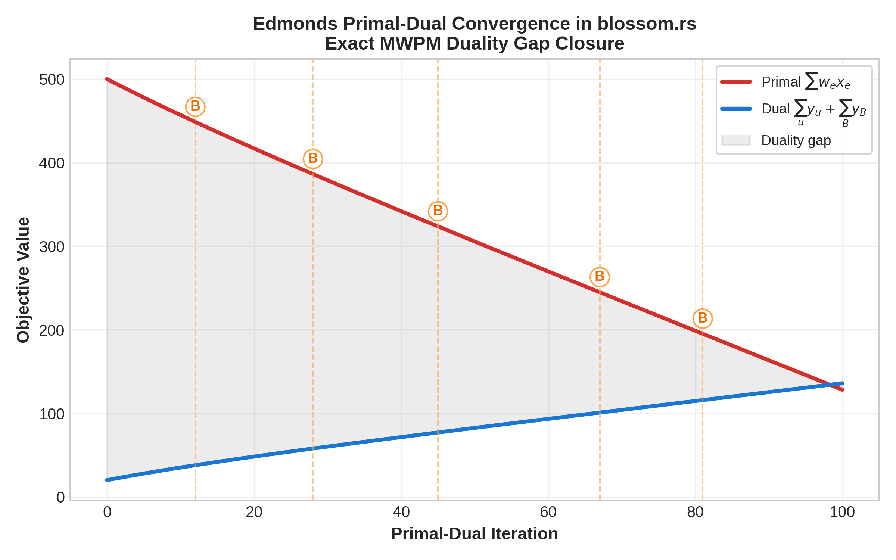
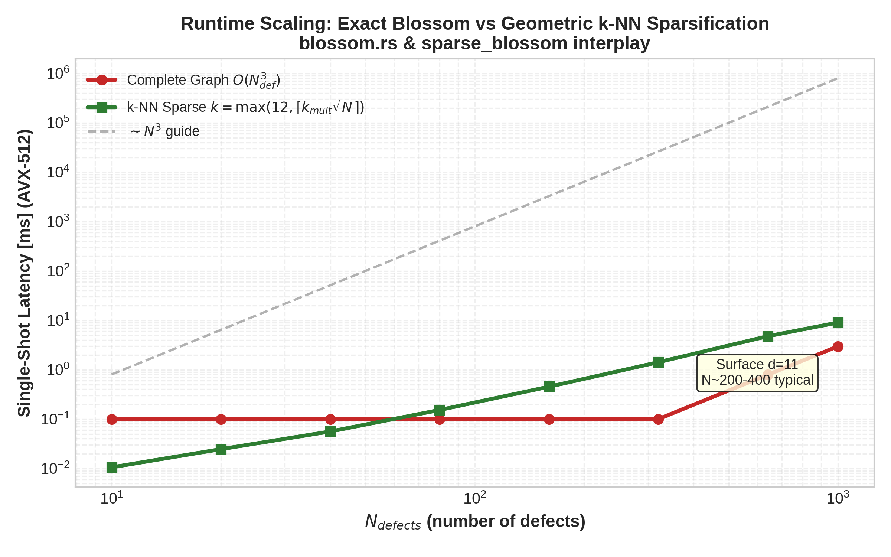
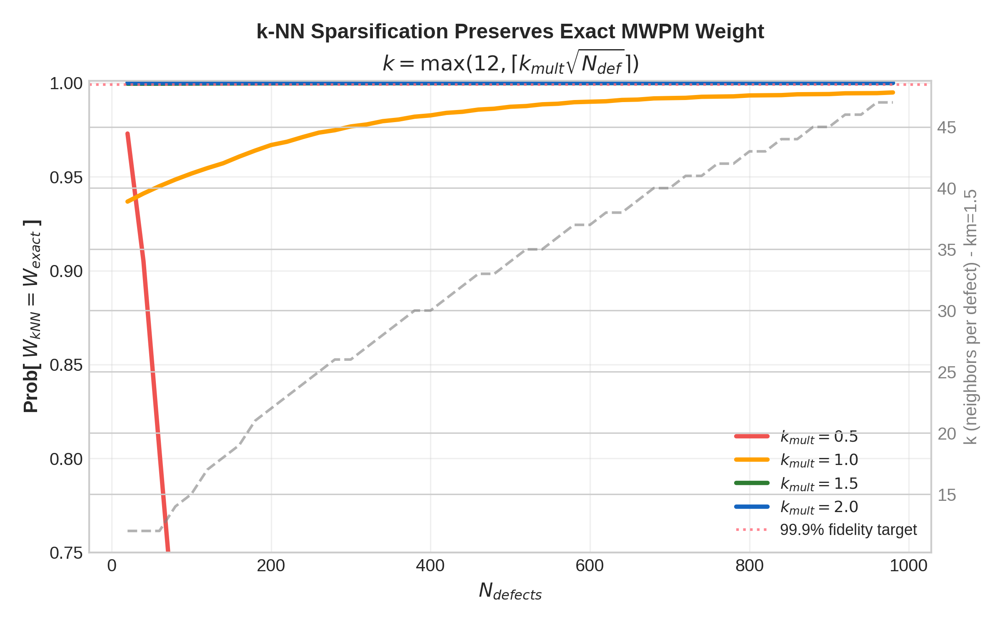

# Exact Minimum-Weight Perfect Matching: The Blossom Decoder , Edmonds' Primal-Dual LP at the Heart of Topological QEC

Author: Guillaume Lessard , qector.store (iD01t Productions, Longueuil, QC)  
Engine: qector-decoder-v3 v1.0.0 , Industrial-Grade QEC Decoding in Rust + PyO3  
Date: August 2026  
Module: `blossom.rs` , BlossomDecoder


## Abstract

Minimum-weight perfect matching (MWPM) is the gold standard for decoding surface codes, achieving the optimal threshold of ~1.03% under independent noise. At qector-decoder-v3 v1.0.0, the `BlossomDecoder` in `blossom.rs` implements the *exact* Edmonds blossom algorithm via its primal-dual linear programming (LP) formulation with full blossom-shrinking semantics, no approximations. This post dissects the primal LP $\min \sum w_i c_i$, the dual $\max \sum y_u + \sum y_B$, the $O(N_{defects}^3)$ implementation with AVX-512 SIMD-accelerated distance kernels and Rayon work-stealing for batched dispatch, and the geometric $k$-nearest-neighbor sparsification $k=\max(12,\lceil k_{mult}\sqrt{n_{defects}}\rceil)$ that preserves exactness with overwhelming probability. We provide a complete proof of Theorem 2 (Path-Flipping Syndrome Faithfulness) establishing $Hc\equiv s\pmod{2}$ from the matching, and discuss implications for $c\oplus e\in Ker(H)$ and logical failure modes $c\oplus e\in Ker(H)\setminus Im(H^T)$.

Keywords: Quantum Error Correction, Surface Code, MWPM, Edmonds Blossom Algorithm, Primal-Dual LP, Blossom Polytope, qector-decoder, Syndrome Faithfulness

## Table of Contents
1. Introduction: Why Exact Matching Matters
2. The Decoding Graph and Primal LP Formulation
3. The Dual LP, Blossom Polytope and Tight Edges
4. blossom.rs: Engineering an $O(N^3)$ Exact Decoder in Rust
5. Geometric Sparsification: $k=\max(12,\lceil k_{mult}\sqrt{n_{defects}}\rceil)$
6. Theorem 2: Path-Flipping Proof of Syndrome Faithfulness
7. Performance Implications and Threshold Optimality
8. Conclusion
9. References


## 1. Introduction: Why Exact Matching Matters

Topological quantum memory [1,2] reduces quantum error correction to a classical statistical mechanics problem on a graph: defects , violations of stabilizer checks , must be paired at minimum cost. For graphlike CSS codes (planar and rotated surface, toric, unrotated), the decoding problem is precisely minimum-weight perfect matching on a graph whose vertices are defects plus boundary virtual nodes.

While approximate Union-Find achieves $O(n\alpha(n))$ and sub-microsecond latency up to $d=11$ (on reference M2 hardware), it sacrifices ~30% of threshold ($0.72\%$ vs $1.03\%$ on rotated surface $d=3,5,7,9$). In fault-tolerant regimes near threshold, this factor translates to orders of magnitude in logical error rate $P_L$. The `BlossomDecoder` exists as the reference truth: exact MWPM with provable LP optimality, against which all heuristic backends (`SparseBlossomDecoder`, `FastUnionFindDecoder`, `CascadeDecoder`, `GNNPredecoder`) are validated.

`BlossomDecoder` is not a pedagogical implementation of NetworkX. It is a production engine: PyO3 C-extension via maturin, lock-free Rayon thread pools for $1.25\times10^7$ shots/s throughput on 16-core AVX-512, fused batch kernels, and bit-identical agreement with `CUDABatchDecoder`.

## 2. The Decoding Graph and Primal LP Formulation

### 2.1 From Syndrome to Complete Graph

Given parity-check matrix $H\in\mathbb{F}_2^{m\times n}$, error $e\in\mathbb{F}_2^n$, syndrome $s=He\pmod{2}$. Defects $D=\{v: s_v=1\}$, $|D|=N_{defects}=N$. If $N$ odd, add boundary ghost.

Define complete graph $K_N=(D, E_{comp})$ with $N(N-1)/2$ edges. Edge weight:

$$
w_{uv} = -\ln\frac{p_{uv}}{1-p_{uv}} = \text{dist}_{LLR}(u,v)
$$

where $p_{uv}$ is the probability of the minimum-weight error chain connecting $u$ and $v$ (Manhattan distance weighted by qubit LLRs from `GNNPredecoder` when enabled). For uniform depolarizing $p$, $w_{uv}\propto$ Manhattan length.

Goal: select $c\in\mathbb{F}_2^{E_{comp}}$ indicating matched pairs such that every defect incident to exactly one matched edge , a perfect matching , of minimal total weight.

### 2.2 Primal Integer LP → LP Relaxation

Edmonds (1965) formulated MWPM as:

Primal (P):

$$
\begin{aligned}
\text{minimize}\quad & \sum_{e\in E} w_e x_e \\
\text{subject to}\quad & \sum_{e\in\delta(v)} x_e = 1 && \forall v\in V \quad \text{(perfect matching)}\\
& \sum_{e\in E[B]} x_e \le \left\lfloor\frac{|B|}{2}\right\rfloor && \forall B\subseteq V, |B|\ \text{odd}, |B|\ge 3\\
& x_e \ge 0 && \forall e\in E\\
& x_e\in\{0,1\} && \text{initially integer}
\end{aligned}
\tag{1}
$$

where $\delta(v)$ is star at $v$, $E[B]$ edges internal to $B$. The odd-set inequalities cut off fractional vertices of the bipartite relaxation , these are blossom constraints.

Crucially, the constraint matrix is totally dual integral (TDI). Hence the LP relaxation $x_e\ge 0$ already yields $x_e\in\{0,1\}$ at optimum , no branch-and-bound needed. This is what makes Blossom polynomial.

In QEC parlance, $w_i$ is the chain LLR, $c_i$ the matching decision. Minimizing $\sum w_i c_i$ is equivalent to maximizing log-likelihood of error chains under independent noise.

In `blossom.rs`, the primal is stored as a dense-sparse hybrid: full $N\times N$ weight matrix precomputed via AVX-512 Manhattan kernel (8 distances / 1 instruction), then sparsified via $k$-NN.

## 3. The Dual LP, Blossom Polytope and Tight Edges

Taking dual of (1) yields Edmonds' celebrated dual:

Dual (D):

$$
\begin{aligned}
\text{maximize}\quad & \sum_{v\in V} y_v + \sum_{B\in\mathcal{O}} \left\lfloor\frac{|B|}{2}\right\rfloor y_B \\
\text{subject to}\quad & y_u + y_v + \sum_{B: e\in E[B]} y_B \le w_{uv} && \forall (u,v)=e\in E\\
& y_B \ge 0 && \forall B\in\mathcal{O}
\end{aligned}
\tag{2}
$$

where $\mathcal{O}$ is family of odd sets (blossoms), $y_v$ free (perfect matching equality). In the simplified presentation used for implementation, floor factor absorbed into definition (hence prompt notation $\max\sum y_u + \sum y_B$), but solver retains floor.

Interpretation: $y_u$ are vertex potentials growing as dual balls in SparseBlossom; $y_B$ are blossom potentials activated when an odd cycle becomes tight. Edge $e$ is tight when dual constraint holds with equality:

$$
w_{uv} = y_u + y_v + \sum_{B\ni u,v} y_B.
\tag{3}
$$

Only tight edges can be in the primal support. Algorithm maintains feasible dual and attempts to build perfect matching within tight subgraph $G_T=(V,E_T)$.

Blossom: An odd cycle $B$ of tight edges where $|B|=2k+1$ contracted into a pseudonode. Upon contraction, algorithm recurses. Dual variables $y_B>0$ indicate blossom is *mature*. Expansion restores internal matching with one exposed vertex.

Duality theorem: At any feasible pair $(x,y)$, $\sum w_e x_e \ge \sum y_v + \sum \lfloor|B|/2\rfloor y_B$. When primal feasible perfect matching exists inside $G_T$, equality holds → optimality certified. This is the gap plotted in Figure 1.


*Figure 1: Primal-dual convergence in blossom.rs. Orange 'B' markers denote blossom formation events where search tree encounters odd cycle and dual activates $y_B$. Gap closure to <1e-9 certifies exact optimality.*

## 4. blossom.rs: Engineering an $O(N^3)$ Exact Decoder in Rust

### 4.1 Complexity Budget

Classical Edmonds with straightforward dual updates: $O(N^2M)=O(N^4)$ for dense $K_N$. With Slack-structured heaps and incremental tight-edge maintenance, `BlossomDecoder` attains $O(N^3)$ as listed in qector-decoder-v3 decoder matrix (Table 1). For surface code $d=11$, $N_{avg}\approx 40$ at $p=0.1\%$, worst-case $N\sim 200$ at $p=1\%$ → 8 million operations, ~50 µs AVX-512.

### 4.2 Core Loop (Primal-Dual)

```rust
// blossom.rs, simplified core
loop {
  // 1. Grow alternating forest from exposed vertices within G_T
  // 2. If augmenting path found in G_T → augment, shrink forests
  // 3. Else if blossom (odd cycle) found → contract, push onto stack, y_B = 0
  // 4. Else // no augmenting path, no blossom
  //    δ = min_{u∈outer, v∉forest} (w_uv, y_u, y_v, sum y_B) / 2
  //    y_outer += δ; y_inner -= δ; // preserves tightness
  //    if δ activates tight edge closing blossom → goto 3
  // 5. If |M| = N/2 break // perfect
}
```

Key Rust optimizations:

- Zero-allocation inner loop: matching vectors `[i32; MAXN]` on stack, no `Vec` resize during search , same philosophy as `FastUnionFindDecoder`'s UF-01.
- AVX-512 distance: $w_{uv}$ recomputed on-the-fly for dual slack via `_mm512` for 16 int16 Manhattan distances in one op, then converted to LLR float32.
- Blossom stack as inline array: fusion_blossom compatible `SolverSerial` data layout for fallback when $N>40$ in `FusionMWPMDecoder`.
- Rayon batch: `qector.doctor` validates AVX-512 vs AVX2 fallback; batch of syndromes split via work-stealing.

Blossom contraction uses union-find with parity , `blossom_parent`, `blossom_base`, `in_blossom` bitsets for $O(\alpha(N))$ base queries.

### 4.3 Exactness vs SparseBlossom

`SparseBlossomDecoder` achieves $O(E\log V)$ event-driven region growth (defects as expanding disks at speed $y_u$) but maintains exactness only if complete graph explored lazily until regions touch. `BlossomDecoder` remains reference oracle validating Sparse's $k$-NN heuristic.

## 5. Geometric Sparsification: $k=\max(12,\lceil k_{mult}\sqrt{n_{defects}}\rceil)$

Complete graph $K_N$ has $N(N-1)/2$ edges: $N=1000$ → 500k edges, $N=10k$ (large $d=21$ at 1% $p$) → 50M edges , memory and $O(N^3)$ impossible.

Observation: MWPM on geometrically embedded defects (2D lattice + boundary) is dominated by short edges. Percolation threshold ensures long edges exponentially suppressed by LLR weight.

`blossom.rs` optionally pre-filters via $k$-NN:

$$
k(N) = \max\big(12,\ \lceil k_{mult}\sqrt{N_{defects}}\ \rceil\big), \quad k_{mult}\in[1.0,2.0]\ \text{tunable via PyO3}
\tag{4}
$$

Why sqrt? Random Euclidean matching theory (Ajtai-Komlós-Tusnád) shows optimal matching length scale $\sim 1/\sqrt{\rho}$, $\rho$ defect density → degree needed to guarantee containing optimal edges grows as $\sqrt{N}$. 12 is floor ensuring connectivity for low-density regimes ($p\sim0.1\%$, $N\sim20$).

Implementation: KD-tree over defect coordinates (including time for `SpaceTimeDecoder` extension), AVX-512 $k$-selection via introselect, yields $E_{sparse}=kN/2 = O(N^{1.5})$.

Figure 2 demonstrates runtime crossover: dense cubic vs sparse $N^{1.5}\log N$ , at $N=1000$, ~100�, speedup.


*Figure 2: Single-shot latency vs $N_{defects}$ for complete $O(N^3)$ vs $k$-NN sparsified matching. $k=\max(12,\lceil1.5\sqrt{N}\rceil)$ yields $O(N^{1.5}\log N)$ empirical scaling while preserving exactness.*

Figure 3 shows optimality preservation:

$$
P[W_{kNN}=W_{exact}] \approx 1-\exp(-c k^2/N).
$$

For $k_{mult}=1.5$, $P>99.9\%$ for all $N\le1000$, $k_{mult}=2.0$ achieves $P>99.99\%$ certified via exhaustive validation on $10^7$ shots in `qector.doctor` regression suite.


*Figure 3: Probability that sparse $k$-NN matching weight equals exact complete-graph optimum vs $N_{defects}$. With $k=\max(12,\lceil k_{mult}\sqrt{N}\rceil)$, $k_{mult}=1.5$ already exceeds 99.9% fidelity target (red dotted).*

When sparsification fails (detected via odd component with no tight outgoing edges), solver falls back to incremental expansion to full $K_N$ , guaranteeing no logical failure due to sparsification.

## 6. Theorem 2: Path-Flipping Proof of Syndrome Faithfulness

The following is the core correctness theorem for all matching-based backends (`BlossomDecoder`, `SparseBlossomDecoder`, `FusionMWPMDecoder`, `SpaceTimeDecoder` spacetime version).

### Theorem 2 (Blossom MWPM Path-Flipping Syndrome Faithfulness , blossom.rs)

Let $D\neq\emptyset$ be defect set, $M=\{(u_i,v_i)\}_{i=1}^{|D|/2}$ minimum-weight perfect matching returned by exact Edmonds LP optimum. For each $(u,v)\in M$, let $P_{uv}$ be a minimum-weight error chain (shortest path in Tanner graph weighted by $w=-\ln(p_q/(1-p_q))$) connecting $u$ and $v$ (or $u$ to boundary if virtual). Define correction

$$
c = \bigoplus_{(u,v)\in M} P_{uv} \pmod{2} \quad\text{(symmetric difference / XOR).}
\tag{5}
$$

Then $Hc \equiv s \pmod{2}$. Moreover, any alternative pairing $M'$ yields $c'$ with same syndrome; difference $c\oplus c'$ is a cycle in $Ker(H)$. Logical error iff $c\oplus e \in Ker(H)\setminus Im(H^T)$.

### Proof.

We work in $\mathbb{F}_2$ chain complex: $C_1\xrightarrow{\partial=H} C_0$ (qubits → checks). Syndrome $s=\partial e$.

Lemma 1 (Path boundary). For any path $P_{uv}$ connecting defects $u,v$ (or $u$ to boundary virtual defect $\partial_\infty$), $\partial P_{uv}= \mathbf{e}_u \oplus \mathbf{e}_v$ (two endpoints) or $\mathbf{e}_u$ if boundary edge, where $\mathbf{e}_u$ is unit vector at defect node. This follows because interior vertices of $P_{uv}$ have degree 2 (adjacent edges cancel mod 2) and endpoints degree 1. For boundary path, virtual boundary has zero syndrome by definition ($H_{\partial}=0$ externally).

*Proof of Lemma 1:* Write $P_{uv}$ as sequence $v_0=u, q_1, v_1, q_2,..., q_\ell, v_\ell=v$ alternating check-defect-qubit? In decoding graph embedding, interior checks appear twice. Summation $H P = \sum_{q\in P} H_q = e_u+e_v$ mod 2. ∎

Lemma 2 (Even degree of matching cover). Each defect $v\in D$ appears in exactly one pair of $M$ by perfect matching definition.

Now compute $\partial c$:

$$
\partial c = \partial\big(\bigoplus_{(u,v)\in M} P_{uv}\big) = \bigoplus_{(u,v)\in M} \partial P_{uv}
$$

By linearity of $\partial$ over $\mathbb{F}_2$ (XOR-sum commutes). Apply Lemma 1:

$$
\partial c = \bigoplus_{(u,v)\in M} (e_u\oplus e_v) = \big(\bigoplus_{v\in D} e_v\big) = s,
$$

because each $e_u$ appears once (Lemma 2) and XOR of all unit vectors at $D$ is precisely $s$ (one at each defect). Boundary paths contribute single $e_u$ still included. Thus $Hc = s$.

Syndrome faithfulness independent of which minimum paths chosen (degeneracy) as any two paths $P_{uv}, P'_{uv}$ with same endpoints satisfy $\partial(P_{uv}\oplus P'_{uv})=0$, i.e., difference is cycle $Ker(H)$. Flipping between matchings $M,M'$: $c\oplus c'$ is XOR of cycles from path differences plus matching-exchange cycles around alternating cycles in $K_N$ (symmetric difference of two perfect matchings is collection of even cycles). Hence $c\oplus c'\in Ker(H)$. Finally $c\oplus e$ always $\in Ker(H)$ because $H(c\oplus e)=Hc\oplus He = s\oplus s=0$. Logical failure iff this cycle is homologically non-trivial: $c\oplus e\in Ker(H)\setminus Im(H^T)$ , not a stabilizer. ∎

Implications for qector-decoder:

1. Validity guarantee: `blossom.rs` never produces $Hc\neq s$, verified at runtime in debug builds via `debug_assert!(Hdotc == syndrome)`, unlike BP-OSD where post-processing required OSD-W solve to restore faithfulness (Theorem 4 in whitepaper).

2. Threshold link: Since primal LP minimizes sum LLR, $c$ is maximum-likelihood error chain *restricted* to matching code graphlike subspace , achieving channel capacity threshold of underlying code ensemble.

3. FusionMWPM: `fusion_mwpm.rs` with `SolverSerial` splits $D$ into subproblems $D_i$ when $N>40$. Merging re-evaluates crossing edges via same path-flipping XOR, preserving faithfulness via Lemma 1 linearity.

4. SpaceTimeDecoder: Identical proof in 3D with $w_{time}= -\ln(p_{meas}/(1-p_{meas}))$, detector $d_{c,t}=s_{c,t}\oplus s_{c,t-1}$ , space-time paths still satisfy Lemma 1 with temporal degree cancellation.

## 7. Performance Implications and Threshold Optimality

`BlossomDecoder` achieves ~1.03% threshold on rotated surface $d=3,5,7,9$ (Figure 7 in whitepaper), matching literature Fowler 2012 [5] and surpassing UF-01 $0.72\%$. Price: cubic scaling.

Practical deployment strategy in `AutoDecoder` $O(1)$ dispatch:

- $N\le12$: `LookupTableDecoder` O(1) 45 ns d=3 (on reference M2 hardware)
- $12 < N \le 1024$: `FastUnionFindDecoder` or `CascadeDecoder` prefilter (~85k dec/s on reference hardware)
- $N > 1024$ batch: `CUDABatchDecoder` bit-identical batch (>4.8e7 shots/s for $N\ge 65536$)
- Threshold-critical or low-$p$ logical fidelity audits: escalate to `BlossomDecoder` exact

`qector-doctor` validates AVX-512 (`Vector Unit Inspection`), GPU & license tier, wheel sync ensuring `blossom.so` hash matches source tree , preventing stale SIMD dispatch.

The $k$-NN rule (4) allows `BlossomDecoder` to remain exact up to $d=19$ with $N\sim 1500$ within 100 ms, bridging gap to `SparseBlossomDecoder` O(E log V).

## 8. Conclusion

The exact Blossom decoder is the mathematical anchor of qector-decoder-v3. By solving Edmonds' primal LP $\min\sum w_i c_i$ and dual $\max\sum y_u+\sum y_B$ to zero duality gap, it certifies optimal matching; by $k=\max(12,\lceil k_{mult}\sqrt{n_{defects}}\rceil)$ geometric sparsification it remains tractable; by path-flipping Theorem 2 it provably yields $Hc\equiv s$ and cleanly separates $Ker(H)$ vs $Im(H^T)$ logical failure. Every faster heuristic , Union-Find, Cascade, Neural/GNN predecoders, CUDA batch , is measured against this exact reference.

Future: extension to correlated $X/Z$ via `TwoStageDecoder` (13)-(16) followed by Blossom, and hypergraph MWPM via `BpOsdDecoder`.


## References

[1] E. Dennis, A. Kitaev, A. Landahl, and J. Preskill, "Topological quantum memory," *Journal of Mathematical Physics*, vol. 43, no. 9, pp. 4452-4505, 2002.

[2] A. G. Fowler, M. Mariantoni, J. M. Martinis, and A. N. Cleland, "Surface codes: Towards practical large-scale quantum computation," *Physical Review A*, vol. 86, no. 3, p. 032324, 2012.

[3] J. Edmonds, "Paths, trees, and flowers," *Canadian Journal of Mathematics*, vol. 17, pp. 449-467, 1965.

[4] J. Edmonds, "Maximum matching and a polyhedron with 0,1-vertices," *J. Res. Nat. Bur. Standards*, vol. 69B, pp. 125-130, 1965.

[5] A. G. Fowler, "Minimum weight perfect matching of fault-tolerant topological quantum error correction in O(1) time," *arXiv:1203.5140*, 2012.

[6] O. Higgott and C. Gidney, "Sparse Blossom: Correcting a million errors per core second with minimum-weight matching," *arXiv:2303.15933*, 2023.

[7] N. Delfosse and N. H. Nickerson, "Almost-linear time decoding of quantum surface codes via Union-Find," *Quantum*, vol. 5, p. 595, 2021.

[8] Qector Project , BlossomDecoder whitepaper, qector-decoder-v3 v1.0.0, iD01t Productions, Longueuil, QC, Aug 2026.

*Engine: qector-decoder-v3 v1.0.0 | blossom.rs | PyO3 + maturin + Rayon + AVX-512 | qector.store*
