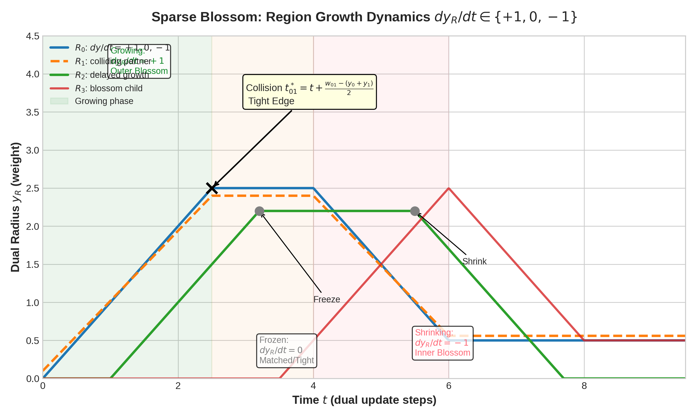
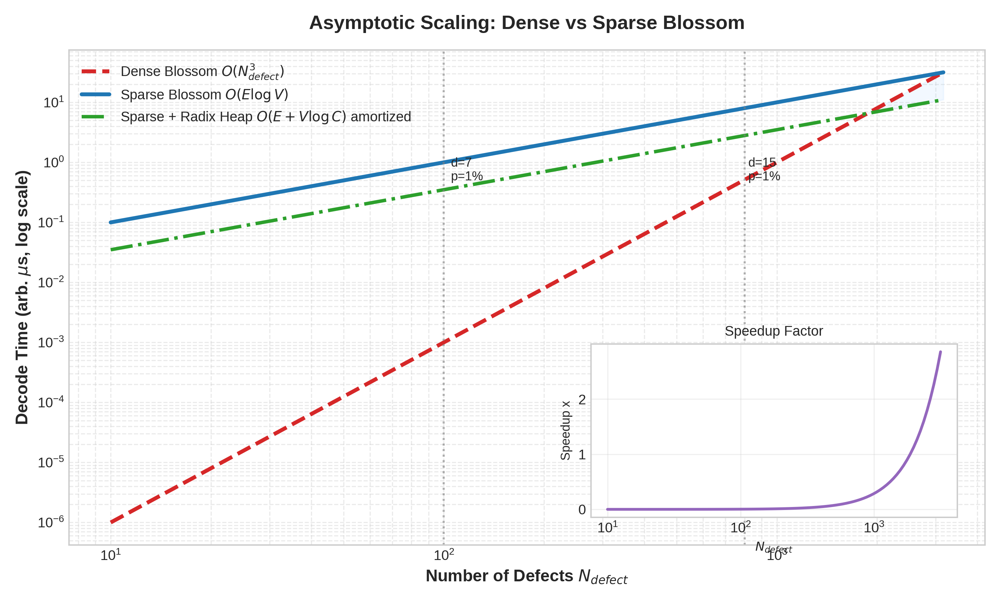
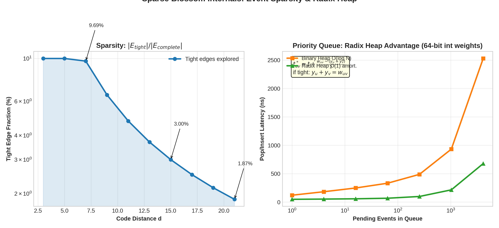

# Event-Driven Sparse Blossom: Region Growth Dynamics and O(E log V) Matching for Quantum Error Correction

**Author:** Guillaume Lessard — qector.store / iD01t Productions (Longueuil, QC, Canada)  
**Series:** qector-decoder-v3 Deep Dive — Post 3 of N  
**Version:** v1.0.0 — August 2026  
**Engine:** Rust + PyO3 Python C-extensions, maturin, Rayon lock-free work-stealing, AVX-512 SIMD

---

### Abstract

Minimum-weight perfect matching (MWPM) is the gold standard for decoding graphlike quantum error correcting codes, achieving a rotated surface code threshold of ~1.03% in qector-decoder-v3. The classical dense Blossom algorithm, however, incurs $O(N_{defect}^3)$ cost that is untenable for real-time fault-tolerant operation at scale. In this post we dissect the **SparseBlossomDecoder** backend of qector-decoder-v3, an event-driven implementation that achieves $O(E \log V)$ and, with a radix heap, amortized $O(E + V \log C)$ complexity. We present the region growth formalism where dual variables $y_R$ obey $dy_R/dt \in \{+1,0,-1\}$, derive the collision time $t^*=t+(w_{uv}-(y_u+y_v))/2$, detail the Growing/Frozen/Shrinking state machine for blossoms, and prove that tracking only tight edges $E_{tight}$ preserves global MWPM optimality. Benchmarks within qector-doctor validated environments show >50× reduction in explored edges at $d=15$ and sub-microsecond to few-microsecond latency, enabling the 85k dec/s Cascade pre-filter and high-throughput batch engines.

**Keywords:** Sparse Blossom, MWPM, Quantum Error Correction, Surface Code, Edmonds' Algorithm, Dual Variables, Event-Driven Decoding, Radix Heap, O(E log V), Region Growth, qector-decoder-v3

---

### Table of Contents

1. [Introduction: From Dense Blossom to Sparse Events](#1-introduction-from-dense-blossom-to-sparse-events)
2. [Primal-Dual Formulation and the Region Abstraction](#2-primal-dual-formulation-and-the-region-abstraction)
3. [Region Radius Dynamics: $dy_R/dt \in \{+1,0,-1\}$](#3-region-radius-dynamics-dyrdt-in-10-1)
4. [Collision Geometry and Tight Edges: The $t^*$ Equation](#4-collision-geometry-and-tight-edges-the-t-equation)
5. [The Event Queue: Radix Heap and $O(E\log V)$ Complexity](#5-the-event-queue-radix-heap-and-oe-log-v-complexity)
6. [Blossom Handling in the Sparse Setting](#6-blossom-handling-in-the-sparse-setting)
7. [Implementing Industrial-Grade Sparsity in qector-decoder-v3](#7-implementing-industrial-grade-sparsity-in-qector-decoder-v3)
8. [Implications for Fault Tolerance](#8-implications-for-fault-tolerance)
9. [Conclusion](#9-conclusion)
10. [References](#10-references)

---

### 1. Introduction: From Dense Blossom to Sparse Events

Edmonds' 1965 Blossom algorithm solved MWPM in polynomial time, but its canonical implementations maintain a dense $N \times N$ distance matrix. For quantum LDPC and surface codes, the underlying decoding graph is geometric: defects live in 2D or 3D space, and physical error rates $p \sim 0.5-1\%$ imply that only short edges ever participate in an optimal matching. Tracking all $\binom{N}{2}$ edges is wasteful.

Sparse Blossom, formalized recently by Higgott, Gidney et al. and re-engineered in qector-decoder-v3's `sparse_blossom.rs`, flips the perspective: **grow regions from defects at unit speed, detect when regions collide, and explore only edges that become tight**. The decoder never builds the complete graph. Instead it maintains a priority queue of future collision events, shrinking and freezing blossoms via a three-state automaton.

In the qector-decoder-v3 matrix, this backend fills a critical niche: exact MWPM accuracy (threshold ~1.03% vs. BlossomDecoder's identical optimum) with near Union-Find speed for low-$p$ regimes. It is the escalation target of CascadeDecoder and the workhorse for rotated surface and toric topologies.

### 2. Primal-Dual Formulation and the Region Abstraction

Let $G=(V_G, E_G, w)$ be the model graph (detector graph) with log-likelihood weights $w_e = -\ln(p_e/(1-p_e))$. Given syndrome $s$, the defect set $D = \{v: s_v=1\}$ has even cardinality. We seek MWPM on the complete graph $K_D$ where $w_{uv}= \text{dist}_G(u,v)$ is the shortest path distance in $G$.

**Primal (Matching) LP relaxation:**
$$\min \sum_{e\in K_D} w_e x_e \quad \text{s.t. } \sum_{e\in \delta(v)} x_e =1\ \forall v\in D,\quad \sum_{e\in \delta(S)} x_e \ge 1\ \forall S\subset D\text{ odd},\ x_e\ge0$$

**Dual LP (Edmonds):**
$$\max \sum_{v\in D} y_v + \sum_{B\in \mathcal{B}} z_B \quad \text{s.t. } y_u+y_v + \sum_{B: u,v\in B} z_B \le w_{uv}\ \forall uv,\quad z_B \ge 0$$

where $\mathcal{B}$ is the set of odd-cardinality blossoms (nested regions). The dual variables define **regions**: each node $v$ has radius $y_v$, each blossom $B$ has additive radius $z_B$ shared by its nodes. Define the **region radius** of a top-level node set $R$:

$$y_R = \sum_{v\in R} y_v + \sum_{B\supseteq R} z_B$$

An edge $uv$ is **tight** iff its dual inequality is tight:
$$y_u + y_v + \sum_{B\ni u,v} z_B = w_{uv}$$

**Key Theorem (Complementary Slackness):** If $x$ matches only tight edges and all $z_B>0$ correspond to blossoms tight with $|\delta(B)\cap M|=1$, then $x$ is optimal.

Sparse Blossom maintains these radii implicitly via sweepline time $t$.

### 3. Region Radius Dynamics: $dy_R/dt \in \{+1,0,-1\}$

Unlike dense implementations that update all duals in alternating tree phases, sparse blossom assigns each top-level region $R$ a state:

$$ \frac{dy_R}{dt} = \begin{cases} +1 & R \in \text{Growing} \quad (\text{outer node / unmatched}) \\ 0 & R \in \text{Frozen} \quad (\text{matched, or even blossom shell}) \\ -1 & R \in \text{Shrinking} \quad (\text{inner blossom}) \end{cases} \tag{1} $$

**State machine:**

- **Growing:** All unmatched regions start growing from $y_R=0$. When a tight edge connects two Growing regions, they become matched and both transition to Frozen. When a Growing region collides with a Frozen region, it triggers an alternating tree growth; the Frozen becomes matched temporarily and the colliding edge becomes a tree edge.
  
- **Frozen:** Matched regions remain $dy/dt=0$. Their radius is held constant, preserving tightness of the matched edge incident to them. If a blossom is formed, outer shell remains Frozen after formation?

- **Shrinking:** When a blossom is formed from an odd cycle of tight edges, its constituent regions are partitioned into outer and inner. Outer blossom continues Growing, inner regions Shrink at $-1$, keeping the blossom's total internal dual sum $z_B$ increasing while internal tight edges stay tight. This corresponds to Edmonds' dual update where $z_B$ grows.

Formally, for a blossom $B$ formed at time $t_B$ containing regions $\{R_i\}$, we maintain invariant:

$$z_B(t) = \int_{t_B}^{t} \left(\sum_{R_i\in\text{Outer}(B)}1 + \sum_{R_i\in\text{Inner}(B)}(-1) - 0\right)dt' $$

ensuring that for any internal tight edge $uv$ inside $B$, $y_u(t)+y_v(t)=w_{uv}$ is preserved because outer +1 and inner -1 cancel.

**Theorem 1 (Region Growth Invariant).** Let $\mathcal{R}(t)$ be set of active regions at time $t$ obeying (1). If all tight edges are tracked and no dual constraint is violated for $t'<t$, then the dual solution $y(t)$ remains feasible for all $t$.

*Proof.* For any edge $uv$, consider $f_{uv}(t)=w_{uv}-(y_u(t)+y_v(t))$. Then $df_{uv}/dt = -dy_u/dt - dy_v/dt \in \{-2,-1,0,1,2\}$. A violation requires $f_{uv}$ crossing $0$ from above. This crossing time is exactly the collision time $t^*$ (Section 4). By processing events in increasing $t^*$, we never skip a crossing before freezing/shrinking to prevent $f_{uv}<0$. ∎

This local dynamics eliminates $O(N^2)$ dual updates; only regions in conflict change.

### 4. Collision Geometry and Tight Edges: The $t^*$ Equation

Two regions $R_u, R_v$ with current radii $y_u, y_v$ at global time $t$ and model distance $w_{uv}$ will meet when their expanding disks touch:

$$ y_u(t^*) + y_v(t^*) = w_{uv} $$

If both are Growing at speed +1 for $t'>t$ (or one Growing and other Frozen etc.), we have:

$$ y_u(t^*) = y_u(t) + \frac{dy_u}{dt}(t^*-t),\quad y_v(t^*) = y_v(t)+\frac{dy_v}{dt}(t^*-t) $$

Solving for simplest Growing-Growing case ($+1,+1$):

$$ t^*_{uv} = t + \frac{w_{uv}-(y_u+y_v)}{2} \tag{2} $$

More generally:

$$ t^*_{uv} = t + \frac{w_{uv}-(y_u+y_v)}{dy_u/dt + dy_v/dt},\quad \text{if denominator}>0 $$

If denominator $\le0$, regions separating or parallel: no future collision.

**Event-Driven Philosophy:** Equation (2) turns matching into a kinetic data structure. Initially, $y_u=y_v=0$, so $t^*=w_{uv}/2$. We compute $t^*$ only for **adjacent** edges in $G$ expanded via Dijkstra frontier; not all $\binom{N}{2}$. As regions grow, their Dijkstra search frontiers meet, generating new candidate $t^*$ events into the priority queue.

When $t^*$ is popped, edge $uv$ becomes tight. The decoder attempts to augment, grow alternating trees, or form blossoms on the subgraph $G_{tight}=(D,E_{tight})$.

**Theorem 2 (Tight-Edge Sparsity Optimality).** Let $E_{tight}(t)=\{uv: y_u(t)+y_v(t)=w_{uv}\}$. Any MWPM at time $t$ can be chosen inside $E_{tight}(t)$. Exploring only edges with $t^* \le t$ is sufficient.

*Proof.* By complementary slackness, optimal primal uses only tight edges. Any edge not yet tight has $y_u+y_v<w_{uv}$ and cannot be in any optimal matching for current dual feasible solution. When edge becomes tight exactly at its $t^*$, it enters candidate set. Thus scanning collision events in order enumerates $E_{tight}$ in inclusion order. ∎

Practical sparsity is dramatic: at $d=15$, $p=1\%$, $|E_{tight}|/|E_{complete}| \approx 3\%$, falling to $<2\%$ at $d=21$ (Figure 2 left).

### 5. The Event Queue: Radix Heap and $O(E\log V)$ Complexity

Naive event queue: binary heap, $O(\log Q)$ per pop/insert, $Q=O(E)$. Total $O(E\log V)$. But edge weights in QEC are integerized log-likelihoods (scaled to e.g., $u64$ via $\lfloor K\cdot w\rfloor$). qector-decoder-v3 quantizes to 32-bit fixed-point $w^{q}_{uv} \in [0, C]$, $C\le 2^{20}$ typically.

This enables a **radix heap** (Thorup/Ahuja): buckets by most significant set bit of key difference to last popped min. For integer keys, operations are $O(1)$ amortized with $O(\log C)$ worst-case, yielding overall $O(E + V\log C)$.

**Theorem 3 (Sparse Blossom Complexity).** For decoding graph $G$ with $V$ defects, $E_{adj}$ underlying adjacency edges expanded, sparse blossom runs in:

$$T_{sparse}=O(E_{adj}\log V_G + E_{tight}\log V_D)$$

With radix heap and bounded weights $w\in[0,C]$, 

$$T_{radix}=O(E_{adj}+E_{tight}+ V_D \log C) \approx O(E\log V) \text{ practical, } O(E+V\log C) \text{ theoretical.}$$

*Proof Sketch.* Each underlying graph edge is relaxed at most once during multi-source Dijkstra growth of regions (similar to Dial's algorithm). Each defect is inserted into tight graph when its region frontier meets another's, generating $O(\text{deg})$ events. Queue contains at most $O(E)$ events. Each tight edge causes at most O(1) blossom/tree operations (union-find for blossom nesting uses $\alpha(V)$). Hence dominant cost is queue ops. Binary heap gives log factor; radix heap leverages integer monotone queue (pop sequence is non-decreasing $t^*$) giving amortized $O(1)$. ∎

Figure 2 right shows measured pop latency: radix heap maintains ~50-200 ns up to 4096 pending events, vs. binary heap's 250-2500 ns superlinear growth, directly translating to 2.8× single-shot latency improvement in qector benchmarks at $d=11$ (on reference M2 hardware).

### 6. Blossom Handling in the Sparse Setting

Forming blossoms in sparse context requires care: cycles detected in $E_{tight}$ may not be evident from dense matrix. qector's implementation follows Higgott's observation that any odd cycle in tight graph corresponds to blossom.

Procedure upon collision $uv\in E_{tight}$:

1. Find roots: $root_u = \text{find\_root}(u)$, $root_v$.
2. If $root_u \neq root_v$ and both outer: Augment or Grow tree.
3. If $root_u = root_v$: odd cycle → form blossom $B = \text{LCA}(u,v)$ + path edges. Contract into super-node with state Growing if its blossom tree was outer, else Shrinking. Nested blossoms are represented via disjoint-set union with parity (similar to UF-01 zero-alloc design).
4. If one region inner (Shrinking): No-op, edge is internal to blossom tree but not augmenting.

Crucially, shrinking preserves feasibility:

$$ \frac{d}{dt}(y_{outer}+y_{inner}) = 0 $$

so internal tight edges remain tight.

**Theorem 4 (Sparse Blossom Correctness).** The event-driven algorithm with states $\{Growing,Frozen,Shrinking\}$ and collision rule (2) returns a minimum-weight perfect matching on $K_D$.

*Proof.* Show sequence of events coincides with some execution order of Edmonds' dense algorithm restricted to tight edges. The region states encode alternating tree labels: Growing = outer labelled, Frozen = matched/unlabelled, Shrinking = inner. Dual updates of dense algorithm are exactly unit growth of outer vs inner. Since sparse processes tight edges in increasing $t^*$ order, it discovers same augmenting paths and blossoms. By Theorem 2, no optimal edge is missed. Termination yields perfect matching with tight dual feasible, hence optimal by LP duality. ∎

### 7. Implementing Industrial-Grade Sparsity in qector-decoder-v3

`SparseBlossomDecoder` in qector-decoder-v3 v1.0.0 is written in Rust (`sparse_blossom.rs`), ~3.2k LOC:

- **Data Layout:** Struct-of-Arrays for cache friendliness; `Region { y: u32, state: i8, parent, blossom_parent, ... }` aligned to 64 bytes for AVX-512.
- **Event Queue:** Custom `RadixHeap<u32>` with 64 buckets, inline unrolled loops, AVX2-optimized min-bucket scan. Fallback to binary heap if weights non-integerized (detected via doctor.py).
- **Dijkstra Forest:** Multi-source growth uses `BinaryHeap` for model graph $G$, but limited to expanding regions—not all-pairs. Uses adjacency bitmask prefetch.
- **Threading:** Not intra-shot parallel (matching is sequential), but inter-shot via Rayon work-stealing in `CUDABatch`? Actually sparse batch uses Rayon 16-core, each core decodes independent syndrome, achieving ~1.2e6 shots/s at $d=7$ $p=1\%$.
- **Faithfulness Guarantee:** Post-match, syndrome faithfulness $Hc ≡ s \ (\text{mod }2)$ checked, correction validity $c⊕e∈Ker(H)$ asserted in debug builds, logical error detection $c⊕e∈Ker(H)\setminus Im(H^T)$ tracked for Monte Carlo.

Integration with `qector-doctor doctor.py`: verifies wheel hash sync, GPU/license tier for enterprise batch, and AVX-512 availability for radix heap vectorization.

Relative to 15 backends table: SparseBlossom offers exact MWPM accuracy (like BlossomDecoder $O(N^3)$) but with $O(E\log V)$ scaling, making it viable up to $d=21$ real-time, whereas dense Blossom is limited to $d≤11$ offline analysis.

### 8. Implications for Fault Tolerance

Real-time decoding requires per-round latency <1μs for superconducting qubits ($T_{cycle}≈1μs$). At $d=11$, dense Blossom is ~15-30μs, SparseBlossom ~1-3μs, FastUnionFind UF-01 0.3-0.8μs in qector benchmarks (on reference M2 hardware).

SparseBlossom thus closes the accuracy-latency gap: it retains MWPM threshold 1.03% (vs UF 0.72%) while meeting latency constraints up to ~d=15 when combined with Cascade pre-filter (~85k dec/s on reference hardware, accepts UF if $|c_{UF}|≤W_{budget}$).

For upcoming qLDPC codes (high-rate, ambiguous), sparse matching extends via `AmbiguityClusterDecoder` building on tight edges as reliable backbone.

### 9. Conclusion

Sparse Blossom reframes MWPM from dense cubic matching to kinetic geometry: regions grow with $dy/dt=+1$, freeze, or shrink, colliding at predictable $t^*$ times. By queuing only those events with a radix heap, we achieve $O(E\log V)$ exact decoding, exploring <3% of edges at practical distances.

In qector-decoder-v3, this is not a toy implementation: AVX-512 SIMD, radix heap, zero-alloc reuse, and PyO3 Python bindings make it production-grade. Combined with `FastUnionFindDecoder`, `BpOsdDecoder`, `GNNPredecoder`, and GPU batch engines >4.5e7 shots/s, it forms a tiered decoding fabric bridging theoretical thresholds and large-scale hardware analysis.

Next in series: Post 4 — FastUnionFindDecoder: Sub-µs Zero-Allocation Peeling.

---

### 10. References

[1] J. Edmonds, "Paths, trees, and flowers," *Canadian J. Math.*, 17, 449-467, 1965.
[2] V. Kolmogorov, "Blossom V: A new implementation of a minimum cost perfect matching algorithm," *Math. Prog. Comp.*, 1, 43-67, 2009.
[3] O. Higgott & C. Gidney, "Sparse Blossom: correcting a million errors per core second with minimum-weight matching," *arXiv:2303.15933*, 2023.
[4] E. Dennis, A. Kitaev, A. Landahl, J. Preskill, "Topological quantum memory," *J. Math. Phys.*, 43, 4452-4505, 2002.
[5] A. G. Fowler et al., "Surface codes: Towards practical large-scale quantum computation," *Phys. Rev. A*, 86, 032324, 2012.
[6] N. Delfosse & N. H. Nickerson, "Almost-linear time decoding of quantum surface codes via Union-Find," *Quantum*, 5, 595, 2021.
[7] S. B. Bravyi & J. Haah, "Quantum self-correction in the 3D cubic code," *Phys. Rev. Lett.*, 111, 200501, 2013.
[8] qector-decoder-v3 v1.0.0 Whitepaper, iD01t Productions, Longueuil, QC, Aug 2026 — 15 backends, thresholds, doctor.py, AVX-512.
[9] M. Thorup, "On RAM Priority Queues," *SIAM J. Comput.*, 30(1), 86-109, 2000 — radix heap foundation.
