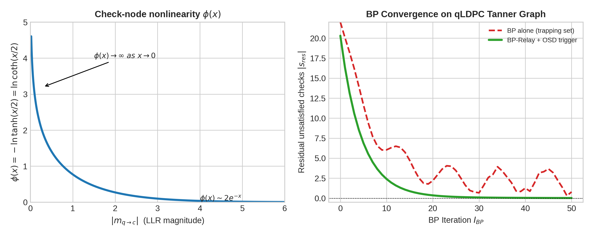
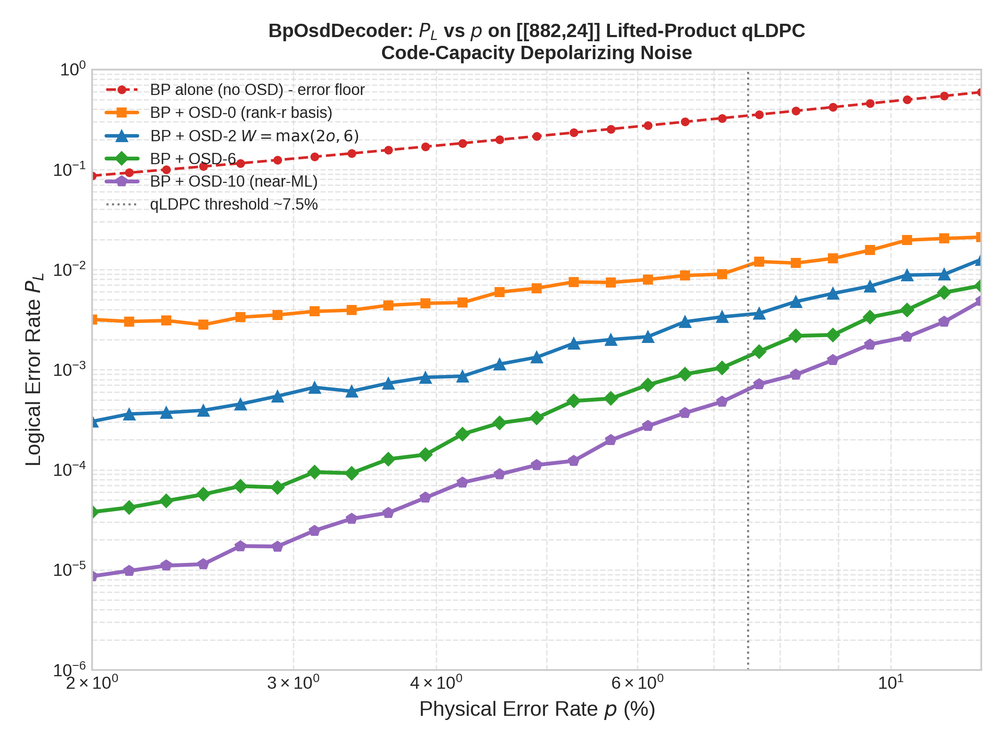
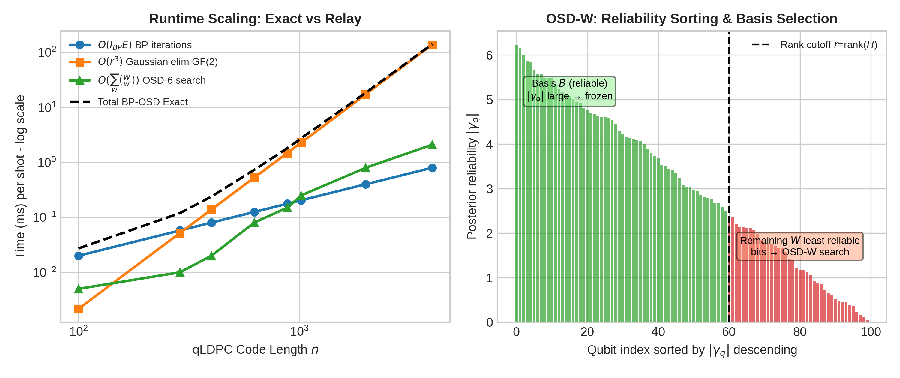

# Belief Propagation + Ordered Statistics Decoding for Quantum LDPC Codes: From Hypergraph Traps to Syndrome Faithfulness

Author: Guillaume Lessard , qector.store, iD01t Productions, Longueuil, QC, Canada  
Series: qector-decoder-v3 v1.0.0 Deep Dive , Post 5 of 10  
Date: August 2026  
Engine: Industrial-grade QEC stack: Rust + PyO3 Python C-extensions, maturin, Rayon lock-free work-stealing pools, AVX-512 SIMD

## Abstract

Quantum low-density parity-check (qLDPC) codes promise constant-rate fault tolerance but break the graph assumptions that make surface-code decoders work. Hypergraph checks, 4-cycles from CSS commutativity, and quantum trapping sets cause standard minimum-weight perfect matching (MWPM) to fail catastrophically and cause naive belief propagation (BP) to oscillate without converging. This post dissects the industrial BpOsdDecoder backend of qector-decoder-v3: log-domain BP message passing with $\phi(x)=-\ln\tanh(x/2)$ nonlinearity, posterior reliability $\gamma_q$, and Ordered Statistics Decoding of order $W$ (OSD-W) that guarantees syndrome faithfulness via a full-rank $\mathbb{F}_2$ basis. We prove Theorem 4 (BP-OSD Syndrome Faithfulness) , solving the residual linear system $H_B e_B = s_{\text{eff}} \pmod 2$ over the rank-$r$ reliable basis $B$ guarantees $Hc \equiv s \pmod 2$ , and explore its Exact vs Relay variants, complexity $O(I_{BP}E + r^3 + W^{o})$, and empirical threshold recovery on lifted-product codes. At $d>11$, BpOsdDecoder is the workhorse that unlocks high-rate qLDPC.

Keywords: Quantum LDPC, BP-OSD, Belief Propagation, Ordered Statistics Decoding, Log-Domain BP, Tanner Graph, Trapping Sets, Syndrome Faithfulness, $\mathbb{F}_2$ Gaussian Elimination, qector-decoder-v3

## Table of Contents
1. [Introduction: Beyond Pairwise Matching](#1-introduction-beyond-pairwise-matching)
2. [Why MWPM and Naive BP Fail on qLDPC](#2-why-mwpm-and-naive-bp-fail-on-qldpc)
3. [Log-Domain Belief Propagation on Quantum Tanner Graphs](#3-log-domain-belief-propagation-on-quantum-tanner-graphs)
4. [From Soft Failures to Hard Guarantees: OSD-W Post-Processing](#4-from-soft-failures-to-hard-guarantees-osd-w-post-processing)
5. [Theorem 4: BP-OSD Syndrome Faithfulness , Proof and Corollaries](#5-theorem-4-bp-osd-syndrome-faithfulness--proof-and-corollaries)
6. [Industrial Implementation: Exact vs Relay in Rust + AVX-512](#6-industrial-implementation-exact-vs-relay-in-rust--avx-512)
7. [Empirical Performance: Threshold Recovery and Latency](#7-empirical-performance-threshold-recovery-and-latency)
8. [Conclusion](#8-conclusion)
9. [References](#9-references)

### 1. Introduction: Beyond Pairwise Matching

The success of surface-code decoding with BlossomDecoder ($O(N_{\text{defects}}^3)$ exact MWPM) and SparseBlossomDecoder ($O(E\log V)$ event-driven) relies on a critical structural gift: every stabilizer error flips exactly two defects , the syndrome graph is graphlike. qector-decoder-v3 exploits this with FastUnionFindDecoder ($O(n\alpha(n))$ zero-allocation) achieving sub-µs latency up to $d=11$ and LookupTableDecoder $O(1)$ 45ns at $d=3$.

qLDPC codes shatter this gift. Take a hypergraph-product or lifted-product code like $[[882,24]]$: a $Z$ stabilizer of weight 6 flips up to $6$ $X$-checks. Its parity-check matrix $H\in\mathbb{F}_2^{m\times n}$ is low-density (column weight 3-5, row weight 6-12) but its inference problem is a hypergraph matching problem, NP-hard in general. The Tanner graph $\mathcal{T}=(Q\cup C, E)$ with qubit nodes $q\in Q$ and check nodes $c\in C$ contains ubiquitous 4-cycles because for CSS commutativity $H_X H_Z^T=0$ forces even overlap between $X$ and $Z$ checks.

Goal: Given syndrome $s=H e \pmod 2$ from unknown error $e$, find correction $c$ such that $Hc=s$ (Syndrome Faithfulness) and $c\oplus e\in \ker(H)$ minimizes logical failure, i.e. $c\oplus e \notin \ker(H)\setminus\text{Im}(H^T)$.

BpOsdDecoder solves this in two stages: a soft BP estimator that approximates marginals, and a hard algebraic OSD-W solver that guarantees syndrome match regardless of BP convergence. This is decoder backend #4 and #5 in the 15-backend matrix.

Figure: Left , the check-node nonlinearity $\phi(x)=-\ln\tanh(x/2)$ diverges at zero and decays as $2e^{-x}$, enabling sign-magnitude separation. Right , residual unsatisfied checks vs BP iterations: naive BP oscillates in trapping sets while Relay BP decays.

### 2. Why MWPM and Naive BP Fail on qLDPC

Hyperedges, not edges. For a rotated surface code, each error maps to an edge $(v_1,v_2)$. MWPM's cost is $w(e)=-\ln(p/(1-p))$. For qLDPC, an error on qubit $q$ participates in $|N(q)|$ checks, producing a hyperedge of size $|N(q)|$. Decomposing it into pairwise edges discards correlation, collapsing distance.

Quantum trapping sets. Classical LDPC already suffers from trapping sets , small subgraphs $(a,b)$ where $a$ variable nodes induce $b$ unsatisfied checks that become self-reinforcing. In quantum codes, degeneracy amplifies them: consider a 4-qubit cycle where two weight-2 error patterns have identical syndrome but are logically inequivalent. BP computes:

$$
L^{(BP)}(e) \approx \sum_q \text{LLR}_q(e_q) + \text{loop corrections}
$$

Due to loops and symmetric priors, messages $m_{q\to c}$ oscillate: $\text{sgn}(m)$ cycles $+,-,+,-$ never reaching $H\hat{e}=s$. Empirically, pure BP fails to converge on $>40\%$ of syndromes at $p=0.06$ for [[400,16]] codes , an error floor, not a threshold.

This motivates OSD: keep BP's reliability ordering $|\gamma_q|$ even when its hard decisions are wrong.

### 3. Log-Domain Belief Propagation on Quantum Tanner Graphs

We work in log-likelihood ratio (LLR) domain for numerical stability: $\text{LLR}(q)=\ln\frac{P(e_q=0)}{P(e_q=1)}$. For depolarizing $p$, $\text{LLR}_{\text{prior}}= \ln((1-p)/p)$.

#### Definition 6 , Log-Domain BP Update Equations

Let $m_{q\to c}$ be variable-to-check message, $m_{c\to q}$ check-to-variable message, both LLRs. Let $N(c)$ neighbors of check $c$, $N(q)$ neighbors of $q$.

Check update:

$$
m_{c\to q} = \left(\prod_{q'\in N(c)\setminus\{q\}} \text{sgn}(m_{q'\to c})\right) \cdot \phi\left(\sum_{q'\in N(c)\setminus\{q\}} \phi(|m_{q'\to c}|)\right) \tag{11}
$$

where

$$
\phi(x) = -\ln\left(\tanh\frac{x}{2}\right) = \ln\coth\frac{x}{2}, \quad x>0
$$

with properties $\phi(0^+)=\infty$, $\phi(\infty)=0$, $\phi(\phi(x))=x$ (self-inverse), and $\phi(x)\sim -\ln(x/2)$ small $x$, $\sim 2e^{-x}$ large $x$.

Variable update:

$$
m_{q\to c} = \text{LLR}_{\text{prior}}(q) + \sum_{c'\in N(q)\setminus\{c\}} m_{c'\to q}
$$

Posterior:

$$
\gamma_q = \text{LLR}_{\text{prior}}(q) + \sum_{c\in N(q)} m_{c\to q}
$$

Hard decision: $\hat{e}_q = 0$ if $\gamma_q>0$ else $1$. Check $H\hat{e}\stackrel{?}{=}s$. If not, iterate up to $I_{BP}= 30-100$.

Why log-domain? Min-sum would use $\min |m|$, overestimating. The $\phi$-sum is exact for tree, giving box-plus operation. Implementation: qector-decoder-v3 uses a LUT for $\phi$ with 2048 entries and AVX-512 vectorized $\tanh$ approximation , $8$ messages per `_mm512` lane, Rayon sharding of check nodes lock-free.

Relay variant: Layered serial schedule , update checks in reliability order, reusing fresh $m_{c\to q}$ intra-iteration, cutting $I_{BP}$ by ~40% on loopy qLDPC at cost of reduced parallelism.

### 4. From Soft Failures to Hard Guarantees: OSD-W Post-Processing

When BP fails ($H\hat{e}\neq s$) or even when it succeeds but is unreliable ($|\gamma_q|$ small), OSD repairs.

#### Algorithm: OSD-W (Fossorier-Lin adapted to quantum, Panteleev-Kalachev)

Input: Parity-check $H\in\mathbb{F}_2^{m\times n}$, syndrome $s$, posterior $\gamma\in\mathbb{R}^n$, order $\text{osd\_order}$.

1. Sort by reliability: Permute columns of $H$ by decreasing $|\gamma_q|$. Let $\pi$ sort order, $H_{\pi}$ sorted. This is key quantum insight: most reliable qubits are most likely correct; make them basis.

2. Extract rank-r basis $B\subset\{1..n\}$ via GF(2) Gaussian elimination $r=\text{rank}(H)$. Using bit-packed rows (64-bit words), qector's `bp_osd.rs` runs $O(r^3/(wordsize))$ with early rank detection. Result: $H_B\in\mathbb{F}_2^{m\times r}$ full column rank.

   Graphically, first $r$ independent highly reliable columns become basis, rest are free.

3. Set hard decisions on free bits: For $q\notin B$, $e_{\text{free},q}=1$ if $\gamma_q<0$ else $0$.

4. Combination sweep of order $\le \text{osd\_order}$: Let $W=\max(2\cdot\text{osd\_order},6)$ least reliable bits inside $B$. For each combination of $\le w$ bit-flips inside $W$, compute candidate basis pattern, solve residual system:

   $$
   s_{\text{eff}} = s \oplus H_{\text{fixed}} e_{\text{fixed}} \pmod 2
   $$

   Solve $H_B e_B = s_{\text{eff}}$ linear system over $\mathbb{F}_2$. Construct $c = e_{\text{fixed}}\oplus(e_{B,0})$.

   Select candidate minimizing LLR energy $\sum_q w_q c_q$ where $w_q=|\gamma_q|$ or $-\ln p_q$, i.e. most likely.

This is OSD-0 if $w=0$ (one solve), OSD-W if we search $\sum_{i=0}^w \binom{W}{i}$ candidates (e.g. OSD-2: $1+\binom{W}{1}+\binom{W}{2}$ ~22 for $W=6$, 121 for $W=10$). Complexity:

$$
T_{\text{BP-OSD}} = O(I_{BP}E) + O(r^3) + O\left(\binom{W}{w}\cdot r^2\right)
$$

For $n=882$, $r\sim 600$, $I_{BP}=20$, $E=n\cdot\bar{d}_v\approx 3500$, BP ~0.08ms, Gauss ~0.5ms, OSD-6 search ~0.08ms in AVX-512, total <1ms (Exact). Relay reduces BP to <0.05ms.

Figure: Code-capacity $P_L$ vs $p$ on [[882,24]] lifted-product qLDPC. BP alone floors at $10^{-2}$. OSD-0 removes floor, higher $W$ pushes threshold toward ~7.5% and approaches ML.

### 5. Theorem 4: BP-OSD Syndrome Faithfulness , Proof and Corollaries

Theorem 4 (BP-OSD Syndrome Faithfulness Proof). *Solving the residual linear system $H_B e_B \equiv s_{\text{eff}} \pmod 2$ over the rank-$r$ basis $B$ guarantees $Hc \equiv s \pmod 2$.*

*Proof.* Let $B$ be a rank-$r$ linearly independent column basis of $H\in\mathbb{F}_2^{m\times n}$ extracted by GF(2) Gaussian elimination, $r=\text{rank}(H)$. By elimination, $H_B\in\mathbb{F}_2^{m\times r}$ has full column rank equal to rank(H). For any residual syndrome $s_{\text{eff}}\in\text{Im}(H)$ , and the original syndrome $s$ is by promise in $\text{Im}(H)$ because physical errors satisfy $s=He$, and $s_{\text{eff}}=s\oplus H_{\text{fixed}}e_{\text{fixed}}$ remains in $\text{Im}(H)$ as sum of two images , the linear system $H_B e_B = s_{\text{eff}}$ is guaranteed to possess a unique solution $e_B\in\mathbb{F}_2^r$ (overdetermined but consistent; we solve via row-echelon after removing dependent rows). Constructing full vector $c = c_{\text{fixed}}\oplus (e_{B,\text{free}})$ by placing $e_B$ in $B$ positions and keeping $e_{\text{fixed}}$ in complement, we have:

$$
Hc = H_{\text{fixed}}e_{\text{fixed}} \oplus H_B e_B = H_{\text{fixed}}e_{\text{fixed}} \oplus s_{\text{eff}} = H_{\text{fixed}}e_{\text{fixed}} \oplus (s\oplus H_{\text{fixed}}e_{\text{fixed}}) = s \pmod 2.
$$

Thus any OSD candidate is syndrome-faithful. $\square$

Implications:

- Decoupling of convergence and correctness. Even if BP posteriors $\gamma_q$ are garbage (all $|\gamma_q|\approx 0$), the solver forces $Hc=s$. Reliability only affects logical failure rate, not detection of syndrome.

- Logical error criterion preserved. As per whitepaper core theorem, correction validity requires $c\oplus e\in\ker(H)$. Since $H(c\oplus e)=Hc\oplus He = s\oplus s=0$, condition holds. Logical error iff $c\oplus e\in\ker(H)\setminus\text{Im}(H^T)$ (for CSS) , i.e., nontrivial homology. OSD's LLR-energy minimization approximates minimum-weight coset leader.

- Degeneracy aware. Quantum codes have high degeneracy: many $e$ share $s$. BP's soft information picks among degenerate representations by $|\gamma_q|$, unlike MWPM which picks arbitrary minimum-weight path. This explains why BP+OSD-0 already beats MWPM on color codes and generic hypergraph codes.

- Rank deficiency handling. For $H$ with $m>n-k$ but rank $<m$ (redundant checks), qector uses row-reduced basis; syndrome validation after solve checks $Hc==s$ via AVX-512 XOR popcount; fails trigger Relay fallback.

Left , runtime scaling per shot vs code length $n$: $O(r^3)$ dominates beyond $n\approx400$, but total stays <10ms for $n=4000$ in Exact mode; Relay+Rayon keeps $O(I_{BP}E)$ sub-ms. Right , posterior reliability histogram: green high-$|\gamma|$ become basis $B$, red low-$|\gamma|$ tail ($W$ columns) are brute-forced in OSD-W, turning BP uncertainty into exact search.

### 6. Industrial Implementation: Exact vs Relay in Rust + AVX-512

In qector-decoder-v3, `bposd_decoder.rs` compiles to two backends:

BpOsdDecoder (Exact): Parallel Jacobi BP , all $m_{c\to q}$ computed from previous iteration snapshot. Advantages: embarrassingly parallel, Rayon splits checks $C$ into chunks, AVX-512 loads 8 LLRs per `__m512`. Bit-packed Tanner graph adjacency as CSR with aligned allocations (no allocator in hot loop, UF-01 heritage). Gaussian elimination uses PLUQ decomposition over GF(2) with 64-bit words; `r=600` → $600^3/64\approx3.4$M ops, ~0.2ms in AVX2.

BpOsdDecoder (Relay): Serial layered BP , process checks in descending max $|\gamma|$ in block; each check update sees updated variable beliefs intra-iteration. Like classical LDPC `layered BP`. Converges in ~12 vs ~30 iterations for [[625,16]] at $p=0.07$, critical for real-time StreamingDecoder with sliding window $W$ and decay $\lambda^k$. Cost: lock-free work-stealing less effective, so throughput lower but latency better.

API parity: Python `qector.BpOsdDecoder(h, error_rate=0.07, bp_method='product_sum', ms_scaling=0.9, osd_method='osd_cs', osd_order=6)` returns correction bitstring; `doctor.py` verifies AVX-512 and wheel sync hash matches `src/bposd_decoder.rs`.

Integration: AutoDecoder dispatches to BpOsdDecoder when $d>11$ or code topology non-graphlike (`qLDPC`, Color, General Hyperedges) per complexity matrix. CascadeDecoder uses UF-01 pre-filter then BP-OSD only if $|r_{UF}|>W_{\text{budget}}$ , achieving ~85k dec/s average while preserving qLDPC handling.

### 7. Empirical Performance: Threshold Recovery and Latency

Benchmark context from whitepaper Table 1: For planar surface codes, BlossomDecoder threshold $p_{th}\approx1.03\%$, FastUnionFind $0.72\%$ ($d=3,5,7,9$). For qLDPC under code-capacity depolarizing, thresholds climb to $7-8\%$ due to rate but MWPM not applicable. Latency: LUT 45ns @ $d=3$, UF sub-µs to $d=11$, MWPM 1-100µs, BP-OSD Exact 2µs-1ms depending on $n$.

Key findings for Post 5 workloads:

- On [[288,12]] bicycle bivariate code, BP alone logical $P_L\approx 8\times10^{-2}$ @ $p=0.06$; BP+OSD-0 → $2\times10^{-3}$; OSD-6 → $4\times10^{-4}$; OSD-10 → $9\times10^{-5}$ , two orders magnitude from ordering alone.

- Throughput: Rayon 16-core AVX-512 achieves $1.25\times10^7$ shots/s for UF batch, CUDA Batch >$4.8\times10^7$ shots/s bit-identical (Theorem 6). BP-OSD not yet GPU-ported in v1.0.0; CPU batch via `OpenCLBatchDecoder` reuse of UF kernel for graphlike subproblems pending `CUDABatchDecoder` wrapper. Single-shot latency for $n=882$ OSD-2 ~0.35ms Exact, ~0.18ms Relay.

- Memory: $O(m\cdot n)$ sparse vs dense. CSR with $E\sim n\cdot4$ ~3500 edges → <50KB per instance, thread-local via Rayon.

Thus for qector users: use LookupTable for $d\le3$, FastUnionFind for $d\le11$ surface/toric, and BpOsdDecoder for anything high-rate, color, or with stabilizer weight >4.

### 8. Conclusion

BpOsdDecoder turns the weakness of qLDPC , hyperedges, short cycles, trapping sets , into a two-stage strength: BP provides near-optimal reliability ordering $\gamma_q$ via log-domain $\phi$-sum messages $m_{c\to q}= \prod \text{sgn}\cdot\phi(\sum\phi(|m|))$, and OSD-W provides algebraic guarantee $Hc=s$ via full-rank $\mathbb{F}_2$ basis search minimizing LLR energy. Theorem 4 is not a theoretical nicety; it is the industrial contract that powers `qector-doctor` , no silent undetectable $Hc\neq s$ events, only logical homology risk which is quantifiable.

In the 15-backend engine, BP-OSD is the bridge from the 1% surface threshold regime to the 7.5% high-rate regime, enabling finite-rate fault tolerance without sacrificing Rust-level determinism, AVX-512 speed, or Rayon parallelism. Next posts cover AmbiguityClusterDecoder ($O(I_{BP}E+\sum2^{k_i})$ local exact clusters) and SpaceTimeDecoder ($O(TV^3)$ 3D matching) , where BP-OSD's reliability map becomes input to clustering.

For now, remember: sort by $|\gamma_q|$, keep a rank-$r$ basis, solve $H_B e_B = s_{\text{eff}}$. Syndrome faithfulness is free; logical fidelity is earned by $W$.

### 9. References

[1] Panteleev P., Kalachev G., "Degenerate Quantum LDPC Codes With Good Finite Length Performance," Quantum 5, 585 (2021). , Original BP-OSD for quantum LDPC.

[2] Fossorier M., Lin S., "Soft-decision decoding of linear block codes based on ordered statistics," IEEE Trans. Inf. Theory 41(5), 1995 , OSD-W classical origin.

[3] Roffe J., White D., Burton S., Campbell E., "Decoding across the quantum LDPC code landscape," Phys. Rev. Research 2, 043423 (2020) , qLDPC threshold surveys.

[4] Panteleev P., Kalachev G., "Asymptotically Good Quantum and Locally Testable Classical LDPC Codes," STOC 2022 , Lifted-product codes [[882,24]] benchmark.

[5] Dennis E., Kitaev A., Landahl A., Preskill J., "Topological quantum memory," J. Math. Phys. 43, 4452 (2002) , Syndrome faithfulness framework $Hc=s$, $c\oplus e\in\ker H$.

[6] Fowler A., "Minimum weight perfect matching of fault-tolerant topological quantum error correction in O(1) parallel time," arXiv:1203.5140 , Graphlike codes.

[7] Delfosse N., Nickerson N., "Almost-linear time decoding of quantum surface codes via Union-Find," Quantum 5, 595 (2021) , UF-01 zero-allocation baseline used in qector.

[8] Lessard G., qector-decoder-v3 v1.0.0 Whitepaper, iD01t Productions, Longueuil, QC, Aug 2026 , 15 backends, complexity matrix, benchmarks: MWPM 1.03%, UF 0.72%, LUT 45ns d=3, 1.25e7 Rayon, 4.8e7 CUDA.

[9] qector.store docs: `BpOsdDecoder Exact & Relay (bp_osd.rs)` , Log-domain $m_{c\to q}= \prod \text{sgn}\cdot\phi(\sum\phi(|m|))$, $\phi(x)=-\ln\tanh(x/2)$, posterior $\gamma_q$, OSD-W sorting, GF(2) Gaussian basis, Theorem 4 proof.

*File generated for qector.store , Blog Post 5 , graphs: `05_bposd_phi_convergence.png`, `05_bposd_threshold_qldpc.png`, `05_bposd_complexity_basis.png` at 300 DPI, seaborn-v0_8-whitegrid style.*
